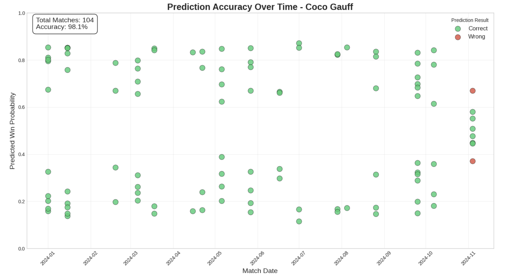

# WTA Tennis Match Prediction

## Project Overview

This project develops a machine learning model to predict the outcomes of Women's Tennis Association (WTA) matches using historical player performance data, ranking information, and other match context features. The model analyzes patterns in tennis match results to forecast which player is more likely to win based on their past performance and various contextual factors. 

Using WTA match data spanning 12 years, this model goes beyond win-loss records, but it uses tennis-specific metrics and temporal patterns that influence match results. The philosophy behind this project is that tennis matches are determined by skill differentials, physical readiness, and match-specific advantages that can be captured by this model. Some predictors include player rank differentials, recent win rate differentials, experience through total career matches and recent activity, rest between matches, and head-to-head advantages. 

The system implements both Logistic Regression and Random Forest to analyze different aspects of tennis prediction complexity with a train-test split using 2024 as the holdout test year. Random forest model achieves 63.9% accuracy, representing a 13.9 percentage point improvement over random chance on a dataset of 34,249 matches spanning 12 years with 1404 unique players.

## Project Steps

* Data collection, loading, and cleaning for CSV files using pandas from 2012 to 2024
* Historical feature engineering using pre-match statistics of each player
* Match context feature for match factors like surface type, tournament timing, player demographic, player dominant hand, and rest periods between matches
* Machine learning model and evaluation to compare different algorithms' accuracy, including Logistic Regression and Random Forest
* Model visualization and insights for comprehensive visualization of predictions, ranging from feature importance rankings to player-specific prediction tracking

## Limitations

* Mental aspect of tennis, including the psychological aspects of the sportlike focus, stress, and fatigue
* Unpredictability of events such as injuries
* Tournament-specific dynamics, such as crowd support and weather

## Next steps

* Enhance features such as incorporating serve speed and shot placement data
* Adding mental factors such as head-to-head psychological trends for interaction patterns
* Live match integration for real-time probability updates during matches
* Comparing this model's predictions with professional odd makers

## Data Source

Dataset is available on Kaggle and Jeff Sackmann's Git Repository using these links: [WTA Tennis Rankings, Results, and Stats (1920-2023)](https://www.kaggle.com/datasets/warcoder/wta-tennis-rankings-results-and-stats2019-2023/data) and [tennis_wta](https://github.com/JeffSackmann/tennis_wta)
